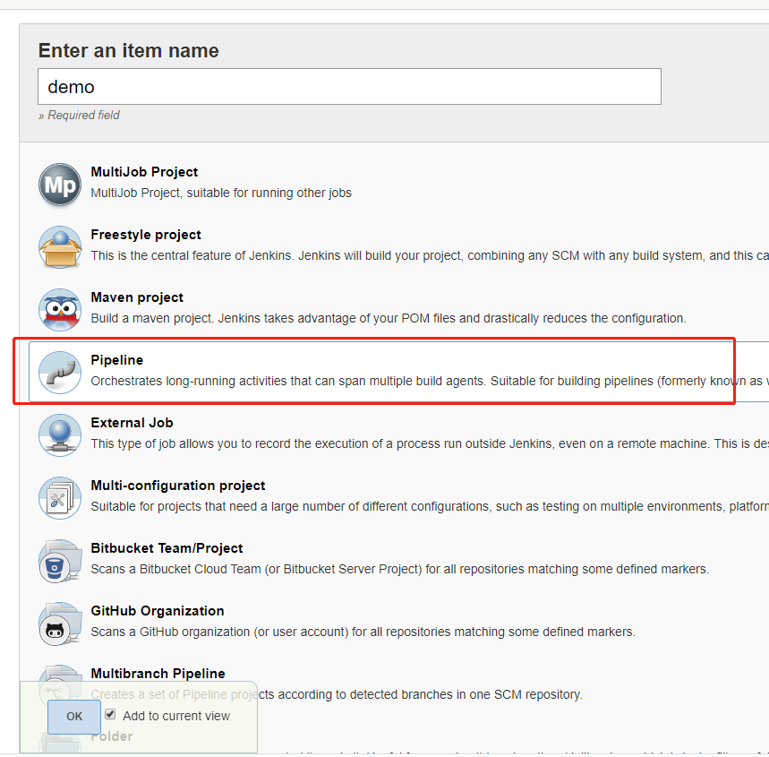
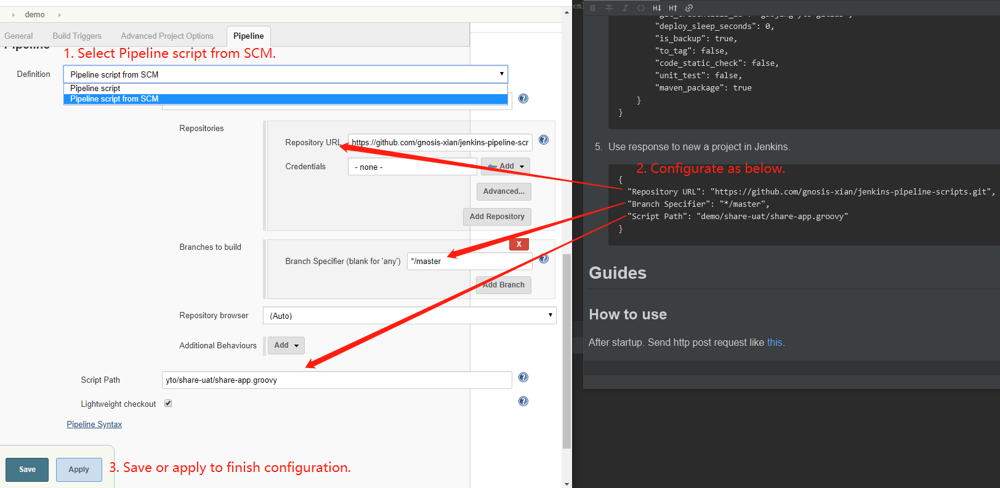
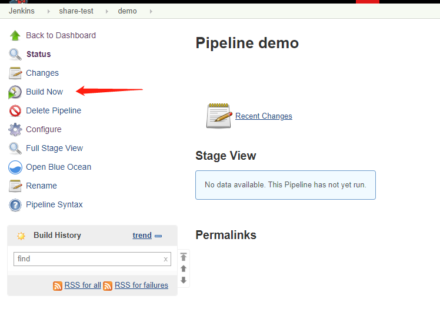

# jenkins-pipeline-generator

Aim to generate jenkins pipeline scripts in easy way.

## Introduction

This project will generate your application jenkins pipeline scripts.

It will help you to create the application CD workflow on jenkins.

Just some steps to configuration. It will be work will.

## Update Information

### 2020-4-17

- Init project.
- Complete Java API jenkins pipeline generator.

### 2020-4-24

- Complete Web jenkins pipeline generator.
- Add **lock** util to prevent request when another process is working.
- SCM url can be define by user.
- SCM url can be multiply.

## Quick Start

1. Install Python version over 2.X;

2. Install flask via pip. 

    ```shell script
    pip install flask
    ```

3. Run.

    ```shell script
    python startup.py
    ```

4. Demo Request

    **The newest request demo file will be present in
    [java-api](./restclient/newest-rest-java.rest)
    and
    [web](./restclient/newest-rest-web.rest).**

    [MUST] Important check.
    
    [NEED] Suggest check.
    
    [OPTION] Check or not.
    
    ```text
    {
        # [MUST]
        "namespace": "demo",
        # [MUST]
        "project_name": "share",
        # [MUST] jenkins pipeline file commit url.
        "scm_urls": [
            "git@github.com:gnosis-xian/jenkins-pipeline-scripts.git",
            "git@gitee.com:accessgnosis/jenkins-pipeline-scripts.git"
        ],
        "jenkins_properties": [{
            # [MUST]
            "git_url": "git@github.com:gnosis-xian/jenkins-pipeline-generator.git",
            # [MUST]
            "branch": "master",
            # [MUST] Jenkins host maven location.
            "maven_home": "/home/gnosis/apache-maven-3.6.1/bin/mvn",
            # [MUST] Jenkins host maven config file path.
            "maven_settings_file_path": "/home/gnosis/apache-maven-3.6.1/conf/yto/settings_yto_new.xml",
            # [MUST] Java execute command on your target deploy host
            "java_home": "/usr/java/jdk_8u231/bin/java",
            # [MUST] Hosts you want to deploy. list[0] is host ip, list[1] is host port. Do not use 22 port recommend.
            "target_hosts": [
                ["192.168.207.49", "22"],
                ["192.168.207.49", "22"]
            ],
            # [MUST] Application name
            "app_name": "share-app",
            # [MUST] Project environment
            "env": "uat",
            # [NEED] CD hosts application home path.
            "app_home": "/root",
            # [MUST] Application or controller, and it decided by maven configuration.
            "type": "application",
            # [MUST] Project version, also decided by maven configuration.
            "project_version": "1.0.0-SNAPSHOT",
            # [NEED] Deploy host user.
            "host_user": "root",
            # [MUST] Credentials in Jenkins. It make sure you can clone you code via git. You should config it in your Jenkins.
            "git_credentials_id": "gaojing-yto-gitlab",
            # [OPTION] Segement time in multi deployed.
            "deploy_sleep_seconds": 0,
            # [OPTION] Backup oldder application package?
            "is_backup": false,
            # [OPTION] Tag your project with current branch?
            "to_tag": false,
            # [OPTION] Code static check? NOT IMPELEMENT.
            "code_static_check": false,
            # [OPTION] Unit test? NOT IMPELEMENT.
            "unit_test": false,
            # [OPTION] Package via maven?
            "maven_package": true
        }]
    }
    ```

5. Use response to create a new project in Jenkins.

    Response:
    
    ```json
    {
      "Repository URL": "https://github.com/gnosis-xian/jenkins-pipeline-scripts.git",
      "Branch Specifier": "*/master",
      "Script Path": "demo/share-uat/share-app.groovy"
    }
    ```
   
   5.1 New Jenkins pipeline project.
   
   
   
   5.2 Config.
   
   
   
   5.3 Finish and build.
   
   

## FQA

### 1. Pipeline selection not found when create jenkins project.

Install pipeline plugin named **Pipeline** with Jenkins **Manage Plugins**.

### 2. Can't pull with git.

- Check **git_credentials_id** parameter. And it has config in Jenkins **Credentials**.

- Check git_url is right.

## Contributors.

[gnosis-xian](https://github.com/gnosis-xian)