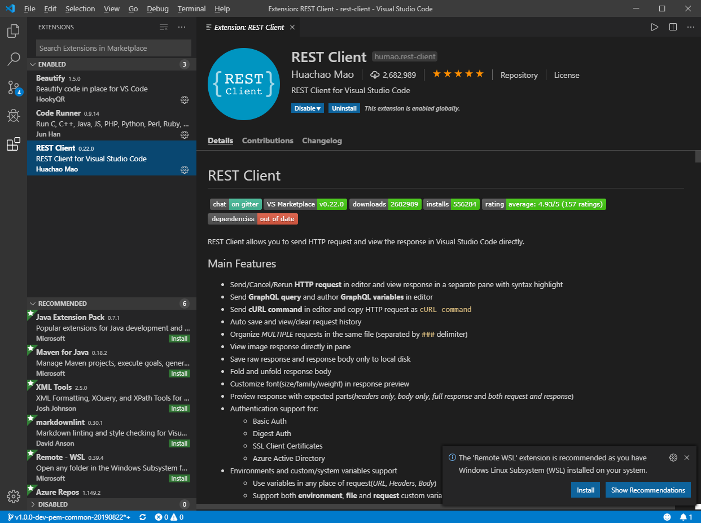
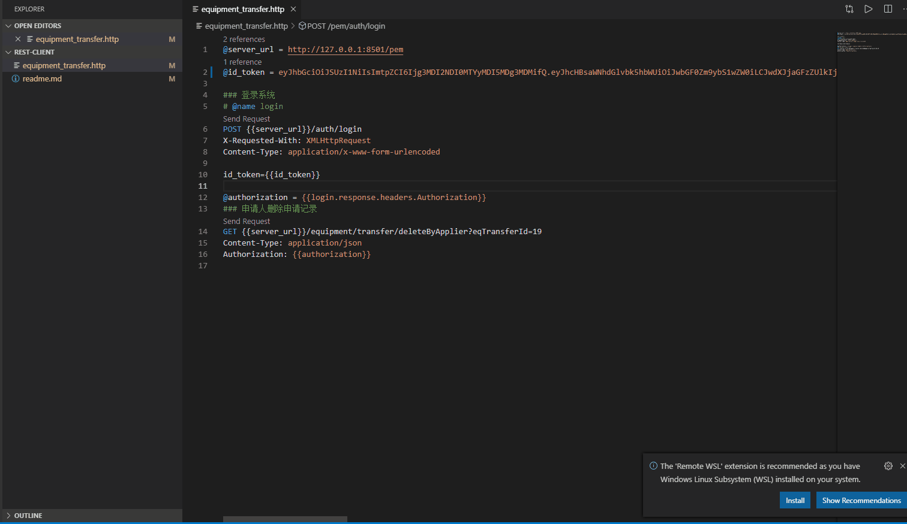

# Rest Client

## Quick Start.

Rest client file suffixed with .http or .rest.

Use rest client plugin in VSCode to open it.

Search rest client in vscode, and install REST Client(humao.rest-client) version.

---

Rendering as below:

## More

[Best Practice With Shimako.](http://note.youdao.com/noteshare?id=ea26af4e82c333dddbed9b0330af0148&sub=wcp1566995451897797)